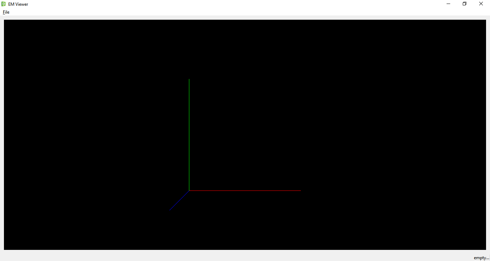
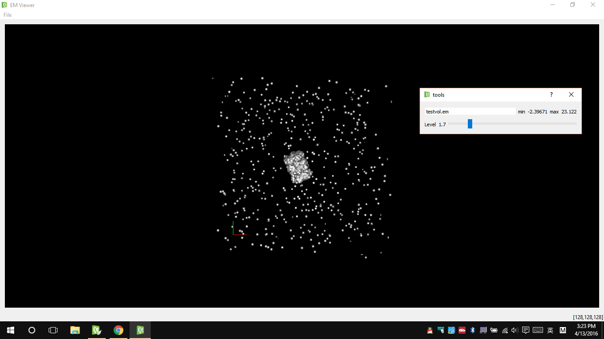

#3D Visulization of EM(Cryo-electron) file.

~~1.display 2d slice of 3D object. example:~~  

~~2.reresult of 3d visulization, testvol.em~~

~~3.add tools to set threadhold and show different visulization result.~~

~~for example:~~

~~levle = -0.4~~

~~level = 0.0~~

~~level = 1.6~~

2016/04/12, fix the bugs :
 
1. visulize each object in the center of scene, at every open time.

2. draw the bounds of the object with dotted line and color green. 

level = 1.7, with bouding box

2016/04/13, fix the bugs :

1. add axes and fix the expanding bug at program start.

start, expand with window size

level = 1.7, with axes

